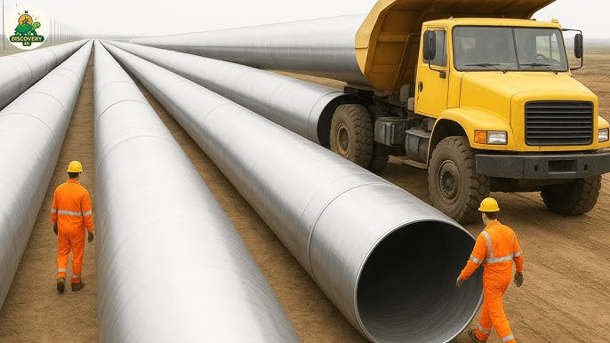

Welcome to my collection of projects. Here you’ll find a selection of my work and projects that I've developed at CMU!

{: style="height:200px"}

[Steel Production Pipeline](/projects/Steel-Production-Pipeline)

{: style="height:200px"}

[Entrepreneur Final Presentation](/projects/Steel-Production-Pipeline)

## Steel Production Pipeline

Project Type: Semester Project

Location: Carnegie Mellon University

Role: Manufacturer and Designer

This project is about constructing a steel manufacturing pipeline. This was created for the course, The Manufacuring Pipeline, where I worked with a team of 4 to create and develop a production pipeline from scratch.

In this project I created an efficient team and design layout for the production. We developed the final product through trial and error. From this experience, I really developed my teamworking abilities as well as my communication skills.

## Entrepreneur Final Presentation

Project Type: Final Project

Location: Carnegie Mellon University

Role: Lead 

This was my final presentation for the class Entrepreneurship 101, where I presented my process and progress in developing a business from scratch over the course of 3 months.

In this project I was able to generate XXX profits by by utilizing my marketing skills and advertising strategies....